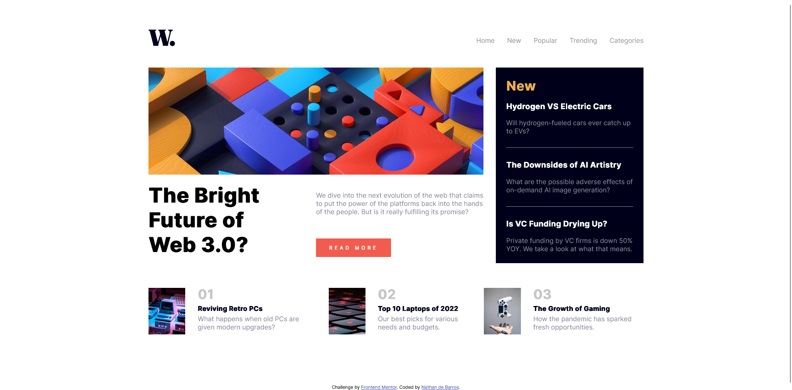

### The challenge

Users should be able to:

- View the optimal layout for the interface depending on their device's screen size
- See hover and focus states for all interactive elements on the page

### Screenshot

### Links

- Solution URL: [solution URL here](https://github.com/nathandb7/News-homepage-frontendmentor)
- Live Site URL: [live site URL here](https://your-live-site-url.com)

## My process

### Built with

- Semantic HTML5 markup
- CSS custom properties
- Flexbox
- CSS Grid
- Mobile version

## Author

- Website - [Nathan de Barros](https://nathandb7.github.io/)
- Frontend Mentor - [@nathandb7](https://www.frontendmentor.io/profile/nathandb7)